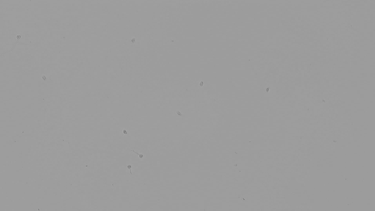
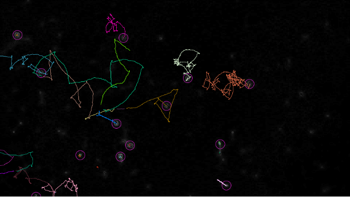

```{r global_options, include=FALSE}
knitr::opts_chunk$set(fig.width=6, fig.height=4, fig.align="center",
                      echo=TRUE, eval=FALSE, warning=FALSE, message=FALSE)
```

# Introduction

Trajectory data is ubiquitous across biology: living systems are dynamic and we can learn a lot from understaning their movement! If you're working with trajectories, you usually start with a video taken via a microscope or lab camera or drone, depending on your system of interest. 

We'll spend a little time before we get to analyzing some trajectory data in R figuring out how we get from a video of cells moving around (in not-always-great contrast images -- if you look carefully at this freeze frame image from the microscope you'll see cells)



...to trajectories that provide us with $(x,y)$ positions for our objects of interest over a particular time course.  



We'll go through this process together using the TrackMate plugin in ImageJ. You should have already installed FIJI, which includes all the functionality needed for this workshop. If you have any issues, let us know before we start!

## Visualizing and analyzing trajectories in R

Trajectories are simplifications of a real path traveled by an object (animal, cell, molecule). Usually (and also for the purposes of this workshop!) this comes in the form of 2-dimensional spatial coordinates (x,y) with a third temporal dimension (t).

*Loading and plotting trajectory data*

We'll first load an example trajectory, taken from one of the cells in the video we analyzed at the start of this workshop. 

[All the data files we’ll work with are in the data folder, so we will set our working directory accordingly.]

```{r}
coords <- read.csv("data/species1_track.csv",header=TRUE)
```

Before we do anything else, let's quickly visualize this trajectory for a sanity check and to see what we're working with. 

```{r}
plot(coords$POSITION_X,coords$POSITION_Y, type='l', ylab='y', xlab='x')
```

*Basic trajectory features -- step lengths, turn angles, speeds*

A trajectory can also be thought of as a series of steps, each comprised of a length ($L_i$), a turning angle ($\Delta_i$), and a time. Between two points $(x_i,y_i)$ and $(x_{i+1},y_{i+1})$, we can calculate the step length $L_i$ from the distance formula $L_i = \sqrt{(x_{i+1}-x_{i})^2+(y_{i+1}-y_{i})^2}$.

***Exercise:*** Using the $(x,y,t)$ data stored in the `coords` variable, calculate out a vector of step lengths for each timestep in the trajectory. Store the outputted list as  `step_lengths`. What length should this vector be? 

***Exercise:*** Using the $(x,y,t)$ data stored in the `coords` variable, calculate out a vector of step lengths for each timestep in the trajectory. How would you calculate this value from this positional data? Store the outputted vector as `angles`.

We can also do some slightly more complex computations to understand a bit more about the underlying dynamics. First, let's look at how the object's speed varies over the trajectory. We can calculate the 'instantaneous' speed at a time $t_i$ by $speed_i = |\frac{L_i}{(t_{i}-t_{i-1})}|$. Note: if our trajectory is measured at constant time intervals, then $t_i - t_{i-1}$ is the same for all $i$. 

***Exercise:*** Using the $(x,y,t)$ data stored in the `coords` variable, calculate out a list of speeds for each timestep in the trajectory. Store the outputted list as a variable `speeds`. 

***Exercise:*** Using the information in `speeds`, calculate out various metrics that might give you some information about the overall trajectory like the mean speed, max speed, standard deviation in speed, etc. 

*Working with the `trajr` package*

It's incredibly useful to know how to do some basic analysis like we went through, but one nice thing about languages like R is having a lot of packages that have a lot of built-in functions that can do some of these computations for us! Here we'll work with the `trajr` package so let’s load this before we begin.

```{r}
library(trajr)
```

If you get an error message, you might need to install the packages. You can do so using the command `install.packages(“trajr”)`. 

The file `QBio_NirodyWorkshop.Rmd` has R code that you can run, but we’ll go through most of the steps here as well. 

The `trajr` package represents trajectories as R **objects** in the class `Trajectory`. To create a `Trajectory` object, we use the `TrajFromCoords` function from a set of x-y coordinates and times. For our purposes, we can load these trajectories into R from .csv files, where the first column is the x-coordinates, the second column is the y-coordinates, and the third column is times. [Note that times are an optional input for `trajr` Trajectories.]

We'll use the data we loaded into `coords` and convert that into a `trajr Trajectory`. 

```{r}
trj <- TrajFromCoords(coords, spatialUnits='pixels', timeUnits = 'frames')
plot(trj)
```

Using some built-in functions, we can also get out information on the timecourse of the trajectory, including the distribution of turning angles and step lengths like we did earlier

```{r}
trajr_angles <- TrajAngles(trj)
trajr_steplengths <- TrajStepLengths(trj)
```

***Exercise:*** How do these values compare to the ones we calculated by hand earlier? If you find they don't match, what went wrong? 

Let's visualize the distribution of step lengths and angles. 

***Exercise:*** What might be the best and most informative kind of plot for these data? Why? Use different kinds of plots and see what you get out of them. 

Within the `trajr` package, we can also use `TrajVelocity` and `TrajAcceleration` to estimate these metrics at each point along a trajectory. The `TrajDerivatives` function calculates speed and change in speed along a trajectory. [If we find that the trajectory is very noisy, we can smooth it using the `TrajSmooth` function before calculating these derivatives.]

```{r}
# Calculate speed and acceleration
derivs <- TrajDerivatives(trj)
```

Let's compare the speeds calculated by the `TrajDerivatives` function to the speeds we calculated from scratch above. Use the commands `mean(derivs$speed)`, `max(derivs$speed)`, `min(derivs$speed)`, `sd(derivs$speed)` to compare the values to those computed before.

Let's also plot the two speed calculations side by side. 

***Question:*** What information might a full timecourse of speeds provide us that the overall descriptive metrics might not?

*Working with and manipulating R objects*

Note that when we loaded our data into `coords` and eventually into a `trajr Trajectory`, we were working with spatial coordinates in pixels and time measured in frames. Before we do any meaningful analysis, it's useful to convert these into more physically meaningful units (especially when comparing different datasets, which may be obtained using different cameras!). 
The `TrajScale` function allows us to implement these meaningful scaling parameters to transform our trajectory object before analysis. When a trajectory is digitized from a video (like the one in our example!), we can calculate the appropriate spatial scaling factor as $width_m/width_p$, where $width_m$ is the width of an object in your chosen unit of length (e.g., meter, micron) and $width_p$ is the width of the same object in pixels, as measured from the video. Similarly, time in these trajectories can be appropriately scaled by knowing how many frames per second (fps) are in our recording.

Let's re-upload our example trajectory into `TrajFromCoords`.

```{r}
trj <- TrajFromCoords(coords, fps= 50, spatialUnits='pixels', timeUnits = 's')
plot(trj)
```

Now, using the `TrajScale` function, we can scale the spatial units to our chosen ones (here, we are using $\mu$m):

```{r}
trj <- TrajScale(trj, .45 / 1, "um")
plot(trj)
```

There are also many functions included in the `trajr` package that provide us with some relevant information about our trajectory objects, including some of the important scaling parameters we just learned to input. 

```{r}
TrajGetFPS(trj)
TrajGetTimeUnits(trj)
TrajGetUnits(trj)
TrajGetNCoords(trj)
```

We can also learn some basic information about our trajectory, including the total duration, total length, and total distance from start to end of the trajectory. [These would be pretty straightforward to compute even without the `trajr` package -- try it! We'll come upon some more complex metrics later included within the package later.]

```{r}
TrajDuration(trj)
TrajLength(trj)
TrajDistance(trj)
```

***Question:*** Why would you expect the values outputted from `TrajLength` to be different from those outputted from `TrajDistance`?

***Question:*** Would you expect the sum of all the step lengths to equal the `TrajLength` to be or `TrajDistance` value? Check using the `sum()` function!

*Some more analysis metrics*

The `trajr` package contains several methods to characterize the straightness of trajectories. The simplest one is $D/L$, where $D$ is the distance between the starting and ending points of the trajectory and $L$ is the length of the trajectory [***Note:*** We've talked about this before!] This is calculated by `TrajStraightness`, and the value outputted ranges from 0 to 1, where 1 means the trajectory is a straight line. 

```{r}
TrajStraightness(trj)
```

Another metric of straightness can be used by looking at the distribution of turning angles, as we calculated before. As noted in Batschelet (1981), this metric can be calculated by calling `Mod(TrajMeanVectorOfTurningAngles())`, assuming we are working with a Trajectory with constant step length.

***Exercise:*** Compare these metrics and discuss the pros and cons of each for different types of trajectories.

$E^a_{max}$ is a dimensionless estimate of the maximum expected displacement of a trajectory. Larger values of this parameter represent straighter paths (Cheung et al., 2007). $E^b_{max}$ is $E^a_{max}$ multiplied by the mean step length.

***Question:*** What does $E^b_{max}$ tell us?

We use the function `TrajEmax`. 

```{r}
TrajEmax(trj)
TrajEmax(trj, eMaxB = TRUE)
```

***Exercise:*** Using the `?TrajEmax` function, think about how `TrajEmax` differentiates between random and directed walks. Why might this be important?

The direction autocorrelation function quantifies regularities within trajectories, for instance wave-like periodicities. From this function, we can get an idea of their wavelength and amplitude. This has, in previous studies been used to detect, for example, the winding movements of trail-following ants (Shamble et al., 2017). 

The function `TrajDirectionAutocorrelations`  calculates the differences in step angles at all steps separated by $\Delta$, for a range of values of $\Delta$.The position of the first local minimum of this function may be used to characterise the periodicity within a trajectory. This position is calculated by `TrajDAFindFirstMinimum` (or `TrajDAFindFirstMaximum`). 

***Question: ***: Some trajectories will not have a first local minimum (or maximum). What does this indicate?

```{r}
corr <- TrajDirectionAutocorrelations(trj)
plot(corr)
```

# Working with multiple trajectories

*Loading multiple trajectories into trajr*

Most studies you'll work with will involve multiple trajectories (per individual, per species, or from multiple species!). Accordingly, the `trajr` package provides some functions to load and work with multiple trajectories. We'll work with some of these now, and then (as time permits) switch to play around with some exploratory analyses with various types of data.

```{r}
tracks <- as.data.frame(rbind(
  c("data/species1_track.csv", "Allomyces macrogynus"),
  c("data/species2_track.csv", "Chytriomyces confervae"),
  c("data/species3_track.csv", "Allomyces_reticulatus"),
  c("data/species4_track.csv", "Rhizoclosmatium globosum"),
  c("data/species5_track.csv", "Synchyrtium microbalum"),
  c("data/species6_track.csv", "Blastocladiella emersonii")
), stringsAsFactors = FALSE)
colnames(tracks) <- c("filename", "species")
```

We can then use the function `TrajsBuild` to load these into `trajr`. `TrajsBuild` assumes that you have a set of trajectory files, each of which may have a scale and a frames-per-second value. The function reads each of the files specified in a list of file names, optionally using a custom function, then passes the result to `TrajFromCoords`. Remember that, with no input given, this function assumes that the first column is x, the second is y, and there is no time column. We can use the `csvStruct` argument identify the x, y and time columns if needed.

```{r}
csvStruct <- list(x = 1, y = 2, time = 3)
trjs <- TrajsBuild(tracks$filename, scale = .45 / 1, 
                   spatialUnits = "um", timeUnits = "s", 
                   csvStruct = csvStruct)
```

*Getting stats out from multiple trajectories*

The function `TrajsMergeStats` simplifies the construction of a data frame of values, with one row per trajectory. To use it, you need a list of trajectories (which you can get from calling `TrajsBuild`), and a function which calculates the statistics of interest for a single trajectory.

```{r}
# Define a function which calculates some statistics
# of interest for a single trajectory

characterizeTrajectory <- function(trj) {
  # Measures of speed
  derivs <- TrajDerivatives(trj)
  mean_speed <- mean(derivs$speed)
  sd_speed <- sd(derivs$speed)

  # Measures of straightness
  straightness<- TrajStraightness(trj)
  Emax <- TrajEmax(trj)

  # Periodicity
  corr <- TrajDirectionAutocorrelations(trj)
  first_min <- TrajDAFindFirstMinimum(corr)

  # Return a list with all of the statistics for this trajectory
  list(mean_speed = mean_speed,
       sd_speed = sd_speed,
       #sinuosity = sinuosity,
       Emax = Emax,
       min_deltaS = first_min[1],
       min_C = first_min[2]
  )
}
```

Now that you've defined this function with the statistics of interest, you can pass it onto `TrajMergeStats` to cycle through all the trajectories stored in `trjs`. 


```{r}
# Calculate all stats for trajectories in the list
# which was built in the previous example
stats <- TrajsMergeStats(trjs, characterizeTrajectory)
print(stats)
```

***Exercise:*** Play around with some variants on the `characterizeTrajectory` function!

# Follow-up activities

We've loaded a set of trajectory data into the `data` subfolder; these correspond to 6 trajectories from 6 different species of single-celled fungal zoospores. 

Using both visualization and some of the quantitative metrics we discussed today, what can be said about the movement of these species? Are there some patterns that arise? What similarities or differences between the movement patterns do you observe? How might you quantify these -- what metrics are informative and which ones are not in this particular example?

We encourage you to do this exploration in R, Python, or another programming language you feel comfortable in! Use a combination of your own analyses and built-in functions to explore.

# Acknowledgments

This workshop contains online materials written by Jim McLean.

# References

Batschelet, E. (1981). Circular statistics in biology. ACADEMIC PRESS, 111 FIFTH AVE., NEW YORK, NY 10003, 1981, 388.

Cheung, A., Zhang, S., Stricker, C., & Srinivasan, M. V. (2007). Animal navigation: the difficulty of moving in a straight line. Biological Cybernetics, 97(1), 47-61.

Galindo, L. J., Richards, T. A., & Nirody, J. A. (2023). Fungal zoospores show contrasting swimming patterns specific to phylum and cytology. bioRxiv, 2023-01.

Shamble, P. S., Hoy, R. R., Cohen, I., & Beatus, T. (2017). Walking like an ant: a quantitative and experimental approach to understanding locomotor mimicry in the jumping spider Myrmarachne formicaria. Proceedings of the Royal Society B: Biological Sciences, 284(1858).


